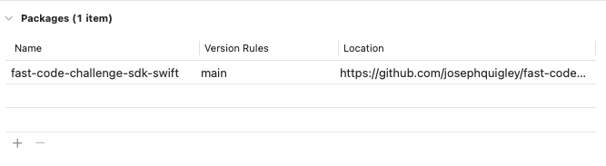

# FastCode.Rocks Challenge Swift SDK

[FastCode.Rocks](https://fastcode.rocks) is a collection of programming challenges for programmers of all skill levels. This SDK provides a simple interface for submitting challenge answers to the FastCode.Rocks backend for scoring.


## What is FastCode.Rocks?
FastCode.Rocks is a programming challenge with a unique twist: Speed of problem execution not speed of problem solving. Essentially, it is a challenge to write the most performant code for a given language and hardware configuration (yours!).

As the popularity of programming challenges grows, new formats have been developed, but the emphasize has remained constant. For example CodeChef uses a browser-based IDE and supports dozens of languages, leveling and expanding the playing field. Going a step further, Advent of Code allows programmers to work in any language and environment, by only submitting results for verification. Unfortunately, even new contests continue to emphasize rapid development; ranking is by first-to-finish. FastCode contests offer a new goal--code performance. FastCode.Rocks believe there is place for faster code, even if it takes a bit longer to craft.

A FastCode challenge measures the time to compute and return a correct answer, not the time to create the solution. Contestants retrieve a unique data set, compute the requested answer, and submit their results, all via a web API. Ranking is based on a rolling average of elapsed time, from retrieval to submission, of previously unseen datasets. Contestant may periodically request additional "competition" datasets for each problem, but example data, with expected results, are always available, to verify the accuracy of a solution before attempting a "competition run".

## Usage

Create a command-line project in Xcode, add the FastCode.Rocks SDK via `Package Dependencies`


### Example Code
```swift
import Foundation
import FastCodeChallenge

let sema = DispatchSemaphore(value: 0)
let fastCode = FastCode(token: "MyToken") // Available from https://fastcode.rocks/profile when you create an account
fastCode.solve(problemId: "d1e13528-d5d3-494b-beed-be83645f09e4",
               onError: {
    fatalError($0.localizedDescription)
},
               onSuccess: { result in
    print(result)
    sema.signal()
},
               problemTask: { data -> Int in
    let jsonStruct = try! JSONSerialization.jsonObject(with: data, options: .fragmentsAllowed)
    
    if let dict = jsonStruct as? [String: Any] {
        return dict.count
    } else if let array = jsonStruct as? [Any] {
        return array.count
    } else {
        return 1
    }
})

sema.wait()
```
